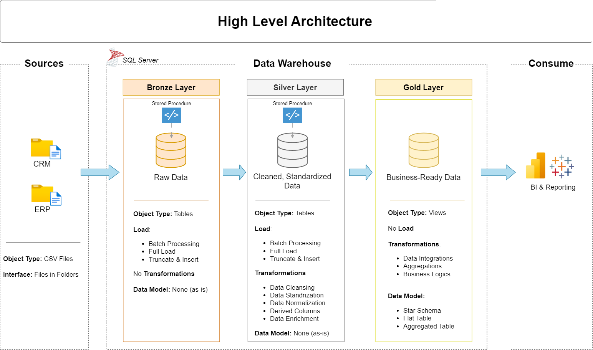

# Data Warehouse & Analytics Solution

Welcome to the Data Warehouse & Analytics Solution repository! 💡
This project showcases a complete end-to-end implementation of a modern data warehouse — from data ingestion to analytics and reporting.
---
## 🏗️ Data Architecture Overview

This solution follows the Medallion Architecture design, structured into Bronze, Silver, and Gold layers:



1. **Bronze Layer**: Contains the unprocessed data directly ingested from the original sources. CSV files are loaded into a SQL Server database without modification.
2. **Silver Layer**: Focuses on refining, cleaning, and standardizing the data to ensure consistency and reliability.
3. **Gold Layer**: Delivers curated, analytics-ready data organized in a star schema for efficient querying and business insights.

---
## 📖 Project Summary

The project demonstrates how to:

1. **Design** a scalable data warehouse based on Medallion Architecture principles.
2. **Build ETL Pipelines** that extract, transform, and load data from multiple sources.
3. **Model Data** into fact and dimension tables optimized for performance and usability.
4. **Generate Insights** through SQL queries and dashboards, turning data into actionable intelligence.

---

## 🚀 Project Requirements

### Data Engineering: Building the Data Warehouse

#### Goal
Implement a unified data warehouse in SQL Server that consolidates sales data for reporting and analytics.

#### Key Tasks
- **Source Data**: Load CSV datasets from ERP and CRM systems.
- **Data Cleansing**: Identify and correct inconsistencies, missing values, and duplicates.
- **Data Integration**: Merge data from both systems into a single, easy-to-use model.
- **Scope**: Work with the most recent data; no need to store historical records.
- **Documentation**: Deliver detailed technical documentation of the data model to guide analysts and stakeholders.

---

### Business Intelligence: Analytics & Insights

#### Goal
Develop data-driven insights using SQL to uncover patterns in:
- **Customer Engagement and Retention**
- **Product Sales and Profitability**
- **Revenue and Trend Analysis**

The final output supports informed, data-backed decisions that drive business strategy.


## 📂 Repository Structure
```
sql-data-engineering/
│
├── datasets/                           # Raw input data (ERP & CRM CSV files)
│
├── docs/                               # Documentation and reference materials
│   ├── data_architecture.png           # Architecture diagram
│   ├── data_catalog.md                 # Dataset metadata and field descriptions
│   ├── data_flow.png                   # Data flow visualization
│   ├── data_models.png                 # Star schema diagram
│   ├── naming-conventions.md           # Table, column, and file naming rules
│
├── scripts/                            # SQL scripts for ETL operations
│   ├── bronze/                         # Extract and load raw data
│   ├── silver/                         # Cleanse and standardize data
│   ├── gold/                           # Build analytical data models
│
├── tests/                              # Data validation and quality checks
│
├── README.md                           # Project introduction and setup instructions
├── LICENSE                             # Open-source license information
```

---

## 🧾 License

This project is distributed under the [MIT License](LICENSE).
You’re welcome to use, modify, and distribute it
## 👋 About the Author

Hello! I’m **Mohammed Khalifa**, an IT professional with a strong passion for data engineering, analytics, and modern data solutions.
I enjoy transforming raw data into meaningful insights that drive real business value.
